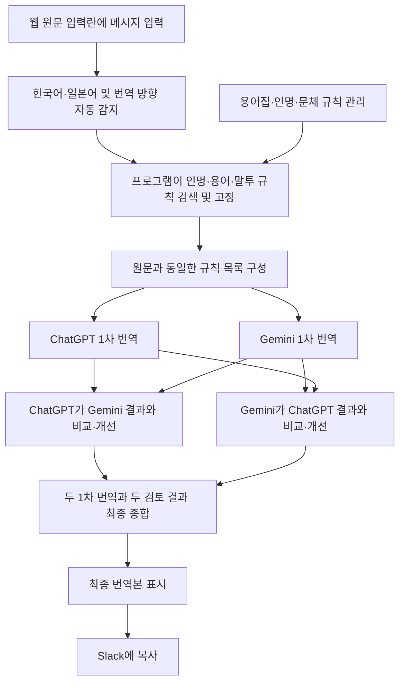

# ENSAPIA Slack 비즈니스 메시지 AI 번역 워크벤치 PRD

상태: 완료

- 문서 버전: v1.0 확정
- 작성 목적: 이번 개발의 제품 목표와 1차 범위를 정의하고 이후 디자인·기능·기술 설계의 기준으로 사용한다.

## 1. 서비스 한 줄 소개

ENSAPIA의 사내 용어·인명·직책·커뮤니케이션 스타일을 자동으로 반영하고, ChatGPT와 Gemini의 번역 및 상호 교차검증 결과를 종합해 하나의 최종 번역본을 제공하는 ENSAPIA Seoul 멤버용 Slack 비즈니스 메시지 AI 번역 워크벤치이다.

## 2. 타깃과 문제 및 대체재

### 2.1 핵심 타깃

1차 사용자는 Slack에서 외국어 비즈니스 메시지를 작성하거나 해석할 때 ChatGPT와 Gemini를 번갈아 사용하며 결과를 수작업으로 비교·수정하는 ENSAPIA Seoul 멤버 1명이다. 품질과 비용을 검증한 뒤 같은 업무를 하는 사내 필요 인원에게 배포할 수 있도록 확장 가능성을 남긴다.

### 2.2 사용자가 해결하려는 문제

사용자는 상대방의 이름·직책·관계와 메시지 상황에 맞는 자연스러운 번역을 빠르게 얻고, 여러 AI 결과를 직접 옮겨 다니며 검토하지 않고도 안심하고 Slack에 붙여 넣고 싶다.

현재 업무에는 다음 문제가 있다.

- ChatGPT와 Gemini에 같은 원문을 각각 입력하고 결과를 다시 서로에게 전달해야 하므로 복사·붙여넣기와 화면 전환이 반복된다.
- Gemini 결과에는 목표 언어로 번역되지 않은 한국어가 남는 등의 오류가 발생할 수 있다.
- ChatGPT 결과는 자연스럽지만 원문의 의미나 강도가 달라지는 의역이 생길 수 있다.
- 이름·직책·호칭, Ontos(IAM) 같은 사내 고유 용어와 서비스명이 번역마다 다르게 표현될 수 있다.
- 요청·거절·사과·독촉 등의 메시지에서 필요한 쿠션어와 비즈니스 말투를 매번 사용자가 직접 조정해야 한다.

### 2.3 현재 대체재

1. ChatGPT 단독 사용: 자연스러운 문장 생성에는 유리하지만 과도한 의역을 사용자가 다시 확인해야 한다.
2. Gemini 단독 사용: 다른 관점의 번역을 얻을 수 있지만 미번역 문구·누락 등을 사용자가 점검해야 한다.
3. 두 모델 수동 교차검증: 품질은 높일 수 있으나 최소 6단계의 복사·비교·수정 작업이 필요하다.
4. 일반 번역기: 빠르지만 ENSAPIA의 인명·직책·용어와 상황별 비즈니스 문체를 반영하기 어렵다.

### 2.4 제품의 강점

- 두 모델의 서로 다른 약점을 상호 검토에 활용하므로 정확성과 자연스러움을 함께 평가할 수 있다.
- AI 호출 전에 프로그램이 원문에서 등록된 인명·호칭·회사 용어·상황별 말투를 찾아 반드시 지킬 표기와 어조로 고정하므로, 두 모델이 같은 기준에서 번역을 시작한다.
- 사내 용어·인명·직책·문체 규칙을 모델에 동일하게 제공해 번역 기준의 일관성을 높인다.
- 기존 수작업 흐름을 한 화면과 한 번의 실행으로 묶어 사용자의 판단 부담을 줄인다.
- ChatGPT·Gemini의 1차 번역과 교차검증은 내부에서만 수행하고, 웹에는 사용자가 바로 복사할 수 있는 최종 번역본 하나만 표시한다.

### 2.5 확정된 범위와 남은 결정

- 1차 버전은 Slack 봇이 아닌 독립된 웹 앱이며, 사용자가 Slack 메시지를 직접 붙여 넣고 웹 화면 안에서 번역·교차검증·최종 결과 확인을 완료한다.
- 화면은 PC 사용을 우선해 설계하고 모바일에서는 반응형으로 핵심 기능을 지원한다. 모바일 전용 앱은 만들지 않는다.
- 초기에는 1명이 사용하며 로그인·조직별 권한은 두지 않는다. 향후 사내 배포 시 인증과 사용자별 접근 권한을 추가할 수 있는 구조를 고려한다.
- 지원 언어는 **한국어 ↔ 일본어 양방향**으로 확정한다. 두 방향 모두 별도의 품질 기준과 검수 사례를 관리한다.
- 사용자는 웹 화면의 원문 입력란 하나에 번역할 메시지만 직접 입력한다. 시스템이 한국어·일본어를 자동 감지해 반대 언어를 목표 언어로 정하고, 원문에 포함된 인명·직책·관계·상황·말투와 사내 용어를 자동으로 판단한다.
- 향후 번역 학습에 활용할 수 있도록 번역 원문, ChatGPT·Gemini의 1차 번역, 상호 교차검증 결과와 최종 번역본을 모두 저장한다. 별도의 우수 번역 사례 분류·보관·관리 기능은 제공하지 않는다.
- 최종 종합 판단은 GPT-5.6 Luna가 담당하는 것으로 기술 설계에서 확정했다.
- ChatGPT와 Gemini API 키는 확보되어 있다. 1차 번역·교차검증에는 GPT-5.6 Luna와 Gemini 3.7 Flash를 사용하고, 최종 종합은 GPT-5.6 Luna가 담당한다. 월 예상 사용량은 300건, 월 AI 비용 한도는 $10으로 확정했다.
- 향후 사내 배포 방식, 사용자 인증 방식과 외부 AI API 전송 정책은 보안 검토 후 확정한다.
- 초기 1인 사용 단계에서는 해당 사용자가 용어집·인명·문체 규칙을 직접 관리한다. 향후 사내 배포 시 관리 권한 방식을 정한다.
- 1차 버전에 문체 규칙 관리, 용어 일괄 가져오기, 용어·인명 수정과 비활성화, 번역 실패 재시도, 건별·일별·월별 비용 상세, 비용 상한 경고, 저장 데이터 기간별 일괄 삭제를 모두 포함한다.

## 3. 핵심 기능과 부가 기능

### 3.1 핵심 기능 1 — 이중 번역·상호 교차검증·최종 종합 파이프라인

사용자가 원문을 입력하고 실행하면 다음 과정을 한 번에 수행한다.

1. 사용자가 웹의 원문 입력란 하나에 번역할 메시지를 직접 입력하면 시스템이 한국어·일본어를 자동 감지해 번역 방향을 정한다.
2. AI를 호출하기 전에 프로그램이 원문에서 등록된 인명·호칭·회사 용어·상황별 말투를 찾는다. 문장 전체를 기계적으로 번역하지 않고, 반드시 사용할 표기·피해야 할 표기·필요한 어조를 별도의 규칙 목록으로 만든다. 사용자가 입력한 원문은 바꾸지 않고 그대로 보존한다.
3. 원문과 같은 규칙 목록을 ChatGPT와 Gemini에 전달해 1차 번역을 동시에 생성한다.
4. ChatGPT에는 Gemini 결과를, Gemini에는 ChatGPT 결과를 제공해 각각 오역·누락·용어·말투·자연스러움·미번역 문구를 검토하고 개선하게 한다.
5. 두 1차 번역과 두 교차검증 결과를 평가 기준에 따라 종합해 하나의 최종 번역본을 만든다.
6. 웹에는 규칙 적용 과정이나 모델별 결과를 표시하지 않고 하나의 최종 번역본과 복사 버튼만 제공한다.
7. 일부 모델 호출이나 저장이 실패하면 성공으로 표시하지 않고 실패 내용을 쉬운 문장으로 알리며 다시 시도할 수 있게 한다.

필요한 이유: 현재 사람이 반복하는 전체 교차검증 과정을 자동화하는 것이 이 제품의 핵심 가치이기 때문이다.

품질 원칙:

- 원문의 의미·수치·고유명사·요청 강도와 부정 표현을 보존한다.
- 목표 언어가 아닌 문구가 남아 있는지 검사한다.
- 한국어→일본어에서는 상대방과 상황에 맞는 경어·쿠션어·호칭을 적용하고, 일본어→한국어에서는 일본어식 표현을 직역하지 않은 자연스러운 사내 비즈니스 문장으로 정리한다.
- 사내 용어집과 인명·직책 표기를 일반적인 번역보다 우선한다.
- 규칙이 겹치면 인명·호칭, 회사 용어, 상황별 말투, AI 일반 판단 순서로 적용하고 두 AI 모두에 같은 규칙 목록을 전달한다.
- 자연스러움을 높이기 위한 의역은 허용하되 의미 변화가 생기면 최종안에 반영하지 않는다.
- 두 모델 중 하나라도 실패하면 교차검증 완료로 표시하지 않고 실패 단계와 재시도 방법을 명확히 보여준다.
- 원문에 포함된 지시문은 번역 대상 텍스트로만 취급하고 시스템 지시로 실행하지 않는다.

### 3.2 핵심 기능 2 — ENSAPIA 번역 기준 관리 및 자동 적용

다음 번역 자산을 등록·수정·비활성화하고 모든 모델 단계에 같은 기준으로 적용한다.

- 사내 용어집: 서비스명, 제품명, 약어, Ontos(IAM) 등 고정 표기와 금지 표현
- 인명·호칭 정보: 여러 한국어 인식 표현, 일본어 통합 표기, 일본어→한국어 번역에 사용할 한국어 통합 표기, 활성 상태
- 상황별 문체 규칙: 인사, 요청, 거절, 사과, 독촉, 확인, 감사 등

필요한 이유: 모델이 매번 다른 표현을 선택하는 문제를 줄이고 ENSAPIA에서 실제로 사용하는 말투와 표기를 일관되게 적용하기 위해서다.

### 3.3 부가 기능

- 최종 번역 복사 및 원문·최종본 나란히 보기
- 원문 언어 자동 감지 및 한국어↔일본어 번역 방향 자동 결정
- 원문에 포함된 상대방·관계·상황·말투·인명·직책·사내 용어 자동 판단
- API 호출 상태, 오류, 재시도, 모델명과 프롬프트 버전 기록
- 번역 1건과 일·월 단위의 API 호출량, 토큰 사용량, 예상 비용 확인 및 비용 상한 경고
- 확정 모델 운영: 1차 번역·교차검증은 GPT-5.6 Luna와 Gemini 3.7 Flash, 최종 종합은 GPT-5.6 Luna 사용
- ENSAPIA 브랜드 색상·서체·분위기를 반영한 반응형 UI

## 4. 화면 목록과 이동 흐름

### 4.1 화면 목록

1. **번역 워크벤치**
   - 사용자가 원문 입력란 하나에 번역할 메시지를 직접 입력
   - 한국어·일본어와 번역 방향, 상대방·관계·상황·말투를 시스템이 자동 판단
   - 내부 단계는 노출하지 않고 하나의 번역 중 상태만 표시
   - 최종 번역본 하나와 복사 버튼
   - 실패 시 오류 안내와 다시 시도 버튼
   - 입력부터 최종 결과까지 이 화면을 벗어나지 않고 완료한다.
2. **용어집 관리**
   - 사내 용어 검색·등록·수정·비활성화·가져오기
3. **인명·호칭 관리**
   - 여러 한국어 인식 표현을 하나의 일본어 통합 표기에 연결해 관리
   - 예: `이시와타리 대표님`, `이시와타리상`, `이시와타리님` → `石渡さん`
   - 새 멤버 등록 시 팀·직책 같은 기본 정보는 입력하지 않고 언어별 표기와 호칭만 입력
   - 일본어→한국어 번역용 한국어 통합 표기 1개를 별도로 입력
   - 등록된 인명·호칭 수정과 비활성화
4. **운영 설정**
   - 모델과 프롬프트 버전, 기본 번역 기준, 저장 정책, API 연결 상태 확인
   - 번역 건별·일별·월별 호출량, 토큰 사용량, 예상 비용과 비용 상한 확인
   - 상황별 문체 규칙 등록·수정·비활성화
   - 기간을 정해 저장된 번역 데이터를 일괄 삭제

### 4.2 이동 및 처리 흐름

## 5. 저장할 데이터와 데이터 사용 원칙

### 5.1 저장할 데이터

- **용어 데이터**: 원어, 권장 번역, 언어, 설명, 금지 표기, 활성 상태, 변경일
- **인명·호칭 데이터**: 여러 한국어 인식 표현, 일본어 통합 표기, 한국어 통합 표기, 활성 상태, 변경일
- **문체 규칙**: 상황 유형, 권장 어조, 쿠션어, 피해야 할 표현, 예문
- **번역 작업 데이터**: 원문, 자동 감지한 번역 방향·상황·말투, 적용한 용어·인명·직책·문체 규칙, ChatGPT·Gemini의 1차 번역, 양쪽 교차검증 결과, 최종 번역본, 사용 모델·프롬프트 버전, 생성 시각을 향후 학습용 원천 데이터로 저장한다.
- **운영 데이터**: 사용 모델, 프롬프트 버전, 호출 시간, 오류 코드, 토큰·비용 추적에 필요한 수치

### 5.2 데이터 사용 원칙

- 개발·테스트 단계에서는 실제 회사 메시지, 고객 정보, 실제 임직원 개인정보를 사용하지 않고 가짜 데이터만 사용한다. 실제 데이터 유출과 외부 AI 학습·보관 위험을 개발 단계부터 차단하기 위해서다.
- 운영 전 회사가 승인한 OpenAI·Google API 계정, 데이터 처리 조건, 보존 정책과 사용 가능 정보 등급을 확인한다.
- API 키는 화면·코드·데이터베이스에 평문으로 저장하지 않고 환경 변수 또는 비밀정보 저장소에 보관한다.
- 모델별 입력·출력 토큰과 호출 횟수를 저장하고, 확정된 공식 단가표를 적용해 번역 건별·일별·월별 예상 비용을 계산한다.
- 비용 상한에 도달하면 추가 호출 전에 경고하고 사용자가 실행 여부를 결정하게 한다. 상한 수치는 실제 테스트 사용량을 확인한 뒤 정한다.
- 모델에는 번역에 필요한 최소 정보만 전달하고, 불필요한 개인정보·고객정보·인증정보는 제거하거나 마스킹한다.
- 원문, 자동 판단한 번역 조건, 모델별 전체 결과와 최종본은 향후 학습용 원천 데이터로 보관한다.
- 저장된 번역 데이터는 우수 사례와 일반 사례를 따로 분류하지 않는다. 1차 MVP에서는 자동 학습에 사용하지 않고, 향후 별도의 검수·익명화 절차를 정한 뒤 학습 활용 여부를 결정한다.
- 저장 데이터에는 사내 메시지와 개인정보가 포함될 수 있으므로 초기 사용자만 접근하게 하고, 저장 시 암호화·삭제 기능·접근 통제를 적용한다.
- 초기 1인 사용 단계에서는 해당 사용자가 용어집·인명 정보·문체 규칙을 직접 관리한다. 향후 사내 배포 시 관리 권한을 추가한다.
- 저장 데이터에는 변경 이력과 사용한 번역 기준 버전을 남겨 결과가 달라진 이유를 추적할 수 있게 한다.

## 6. 제외 범위

다음 항목은 1차 MVP(Minimum Viable Product, 핵심 가치를 검증할 수 있는 가장 작은 완성품)에서 제외한다.

- Slack 워크스페이스에 직접 연결해 메시지를 읽거나 자동으로 전송하는 Slack 봇 기능 — 본 제품은 별도 웹 앱으로 확정한다.
- 문서·PDF·스프레드시트·이미지의 대량 번역
- 실시간 채널 감시와 자동 번역
- 사용자가 과거 번역을 열람·검색하는 별도 기록 화면 — 데이터는 학습 목적상 내부 저장하지만 1차 화면에는 제공하지 않는다.
- 우수 번역 사례를 저장·축적·검색하거나 번역 조건으로 재사용하는 기능
- ChatGPT·Gemini의 1차 번역, 상호 검토 내용과 최종 종합 근거를 사용자 화면에 노출하는 기능
- ChatGPT·Gemini 외 추가 번역 모델 비교
- 사용자 수정 내용을 자동 학습하거나 용어집에 반영하는 기능
- 별도 모델 학습이나 파인튜닝
- 부서별 복잡한 권한 체계, 결제, 외부 고객 계정
- 번역가 수준의 법률·계약·의료 번역 품질 보증
- 모바일 전용 앱

1차 버전은 **메시지 직접 입력 → 사내 기준 적용 → 두 모델 번역 → 상호 교차검증 → 최종 번역 복사** 흐름의 품질과 효율 검증에 집중한다.

## 7. 성공 기준

아래 수치를 1차 제품의 성공 기준으로 사용한다.

1. **번역 품질**
   - 한국어→일본어 25건과 일본어→한국어 25건으로 구성한 대표 Slack 메시지 50건에서 의미를 바꾸는 중대 오역·누락 0건
   - 등록된 사내 용어와 인명·직책 표기 준수율 95% 이상
   - 목표 언어가 아닌 문구가 남는 오류 0건
2. **업무 효율**
   - 기존 수동 교차검증 대비 메시지 1건의 사용자 처리 시간 중앙값 50% 이상 감소
   - 테스트 메시지의 70% 이상에서 사용자가 최종본을 한 번 이하로 수정한 뒤 Slack에 사용할 수 있음

## 8. 예상 복잡도

**큼** — 화면은 4개로 제한할 수 있지만 OpenAI와 Gemini 두 외부 API 연동, 최소 5회의 모델 처리, 병렬 실행, 실패 재시도, 번역 기준 데이터 관리, 개인정보 보호와 비용·지연 관리가 함께 필요하다.

초기 1인 사용 단계에서는 로그인과 조직 권한을 제외해 복잡도를 줄인다. 향후 사내 배포 시에는 인증, 사용자별 접근 권한, 공용 번역 자산의 승인 체계가 추가되어 별도 확장 작업이 필요하다.

복잡도를 높이는 요인:

- 두 모델의 응답 형식과 오류 방식이 달라 결과를 안정적으로 비교할 구조화된 출력 규칙이 필요하다.
- 한 번의 번역에 여러 API 호출이 발생해 응답 지연과 비용을 함께 관리해야 한다.
- 한국어→일본어와 일본어→한국어는 자연스러움과 경어 평가 기준이 달라 방향별 프롬프트와 검수 사례가 필요하다.
- 사내 메시지와 인명 정보가 외부 모델로 전송될 수 있어 운영 전 보안·법무·데이터 정책 확인이 필요하다.
- 원문과 모든 중간·최종 결과를 학습 목적으로 저장하므로 저장소 암호화, 접근 통제, 삭제 정책이 필요하다.
- 용어·인명·문체 규칙이 동시에 적용될 때 충돌 우선순위가 필요하다.
- 최종 번역을 하나로 선택한 이유를 추적할 수 있어야 품질 검수와 개선이 가능하다.

1인 MVP 범위로 유지하려면 Slack 직접 연동, 자동 학습, 복잡한 권한, 대량 파일 번역을 제외하고 내부 제한 환경에서 붙여 넣은 단문 메시지를 처리하는 흐름부터 검증해야 한다.
