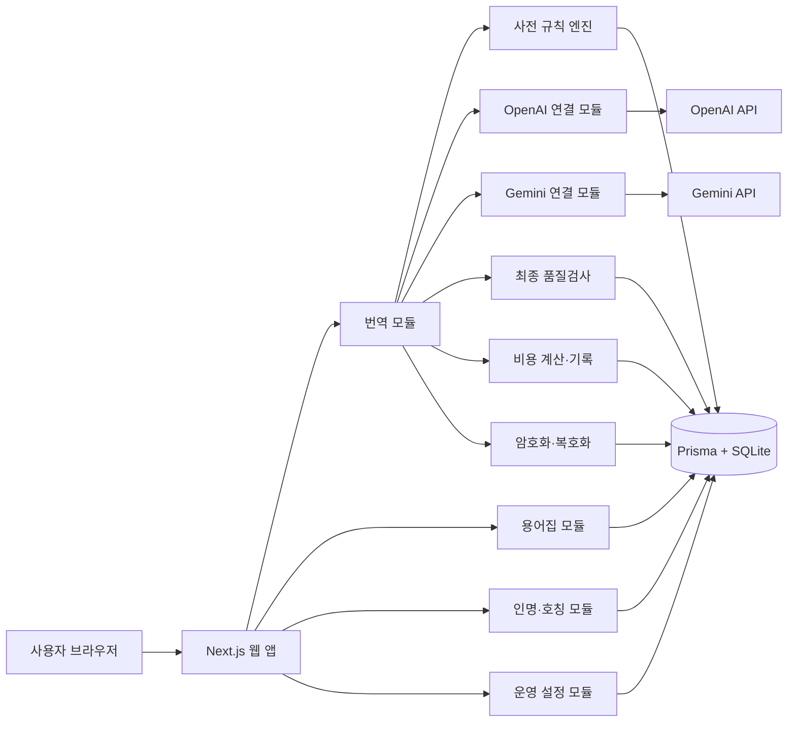

# ENSAPIA Slack 비즈니스 메시지 AI 번역 워크벤치 기술 요구사항 문서

상태: 완료

> TRD는 어떤 기술 재료와 구조로 서비스를 만들지 정한 시공 계획서다. 1차 완료 기준은 사용자 컴퓨터의 `localhost`에서 실제 번역이 작동하는 상태다.

## ① 선택한 기술 스택과 이유 및 비교 대안

### 1.1 확정 스택 — A안

| 역할 | 선택 기술 | 하는 일 | 비용 | 나중에 바꾸려면 |
|---|---|---|---|---|
| 전체 웹 앱 | Next.js + TypeScript | 화면과 서버 기능을 한 프로젝트에서 실행 | 오픈소스, $0 | 보통 — 화면과 서버가 모두 연결됨 |
| 화면 스타일 | Tailwind CSS + 기존 A 시안 자산 | ENSAPIA 디자인을 반응형 화면으로 구현 | 오픈소스, $0 | 쉬움 — 화면 코드만 수정 |
| 서버 기능 | Next.js Route Handler | API 키를 숨기고 규칙 적용·AI 호출·저장을 처리 | 오픈소스, $0 | 보통 — 서버 요청 규칙 변경 필요 |
| 데이터 연결 | Prisma ORM | 코드와 데이터베이스 사이를 연결 | 오픈소스, $0 | 보통 — 데이터 접근 코드 수정 필요 |
| 로컬 데이터베이스 | SQLite | 번역·용어·인명·비용 기록을 파일 하나에 저장 | $0 | 보통 — 회사 배포 전 PostgreSQL로 이전 |
| 입력 검사 | Zod | 잘못된 입력이 서버 처리까지 들어오지 않게 검사 | 오픈소스, $0 | 쉬움 |
| OpenAI 연결 | OpenAI 공식 JavaScript SDK + Responses API | ChatGPT 번역·검토·최종 종합 호출 | 사용량별 과금 | 보통 — 공급자 연결 모듈만 교체 |
| Gemini 연결 | Google Gen AI 공식 JavaScript SDK + Interactions API | Gemini 번역·검토 호출 | 사용량별 과금 | 보통 — 공급자 연결 모듈만 교체 |
| 민감정보 보호 | Node.js 내장 암호화 기능(AES-256-GCM) | 원문과 모든 번역 결과를 읽을 수 없는 형태로 저장 | $0 | 어려움 — 키를 잃으면 복구 불가 |
| 테스트 | Vitest + Playwright | 규칙·비용 계산과 실제 화면 흐름을 자동 확인 | 오픈소스, $0 | 쉬움 |

선택 이유:

- 초기 한 명이 Windows PC에서 사용하므로 별도 데이터베이스 설치나 외부 계정 없이 시작할 수 있다.
- 화면과 서버를 TypeScript 한 언어로 작성해 오류를 찾을 위치를 줄인다.
- 기능별 폴더를 나누되 한 프로젝트 안에 두는 모듈러 모놀리식 구조로 54개 기능을 관리한다.
- OpenAI와 Gemini 연결을 별도 모듈로 격리해 모델이나 API 방식이 바뀌어도 번역 화면과 데이터 구조를 최대한 유지한다.
- SQLite는 1인 로컬 사용에는 충분하지만 Vercel에서 영구 파일 저장소로 쓸 수 없으므로, 회사 배포를 선택할 때 Supabase PostgreSQL로 한 번 이전한다.

### 1.2 AI 모델 조합 — 일부 확정

| 단계 | OpenAI | Gemini | 상태 |
|---|---|---|---|
| 1차 번역 | `gpt-5.6-luna` | `gemini-3.7-flash` | 확정 |
| 상호 교차검토 | `gpt-5.6-luna` | `gemini-3.7-flash` | 확정 |
| 최종 종합 | `gpt-5.6-luna` | 해당 없음 | 확정 |

- GPT-5.6 Luna는 비용을 낮춘 OpenAI 모델이고 Gemini 3.7 Flash는 Google의 현재 고성능 Flash 모델이다.
- 모델 ID는 `model_configs`에 저장해 품질 테스트 후 코드 수정 없이 교체할 수 있게 한다.
- 평균 500자 메시지 기준으로 다섯 번의 호출 전체는 약 $0.008로 추정한다. 3,000자에 가까운 메시지는 약 $0.03~0.05, 실패 단계 재시도 시에는 해당 호출 비용이 추가될 수 있다.
- Gemini 3.7 Flash의 2026년 할인 단가가 끝나는 2027년부터 평균 건당 비용은 약 $0.013으로 오를 수 있다.

### 1.3 실제 회사 메시지의 외부 AI 전송 — 확정

- 현재 Gemini API가 유료 상태라는 전제로 로컬 1인 사용 단계부터 실제 회사 메시지를 번역할 수 있다.
- Gemini 무료 API 키는 실제 회사 메시지에 사용하지 않는다.
- OpenAI Responses API 요청은 `store: false`로 보내며, 별도로 동의하지 않는 한 모델 개선용 데이터 공유를 켜지 않는다.
- 앱의 기본값은 가짜 데이터용 `DATA_MODE=demo`로 둔다. 실제 메시지를 사용하려면 환경 설정에서 `DATA_MODE=real`을 명시적으로 켜야 한다.
- `DATA_MODE=real`을 켜기 전에 사용자가 Gemini 유료 상태와 회사의 외부 AI 전송 허용을 확인했다는 체크 항목을 운영 설정에 표시한다.
- 외부 AI 회사의 기본 안전 점검 보관 정책은 로컬 앱의 저장·삭제 기능과 별개임을 운영 설정에 안내한다.
- 나중에 바꾸려면: 쉬움 — 환경 설정과 운영 허용 상태만 변경한다.

### 1.4 검토 후 제외한 대안

| 대안 | 장점 | 제외 이유 | 로컬 비용 | 회사 배포 예상 | 나중에 바꾸려면 |
|---|---|---|---:|---:|---|
| B. Next.js + Supabase PostgreSQL | 배포할 때 DB 이전 불필요 | 지금부터 계정 또는 Docker 환경이 필요 | $0 + AI | 약 $45/월 + AI | 보통 |
| C. React + Python FastAPI | Python AI 자료가 많음 | 화면과 서버를 두 언어·두 프로그램으로 관리 | $0 + AI | 약 $65/월 + AI | 어려움 |

기준 시점은 2026-09-01이다. Vercel Hobby는 개인·비상업용이며 회사 사용은 Pro $20/월부터, Supabase Pro는 $25/월부터다. 실제 결제 전 공식 요금을 다시 확인한다.

## ② 시스템 구조



### 번역 한 건의 서버 처리 순서

1. 원문이 비어 있지 않고 공백·줄바꿈 포함 3,000자 이하인지 확인한다.
2. 언어를 감지하고 활성 인명·호칭 → 회사 용어 → 상황별 말투 순으로 규칙을 찾는다.
3. 원문은 변경하지 않고 반드시 쓸 표기·금지 표기·어조를 별도 목록으로 만든다.
4. 같은 원문과 규칙 목록으로 OpenAI와 Gemini 1차 번역을 동시에 실행한다.
5. 두 결과를 바꿔 전달해 OpenAI와 Gemini 교차검토를 동시에 실행한다.
6. GPT-5.6 Luna가 두 번역과 두 검토를 종합해 최종 번역 하나를 만든다.
7. 프로그램이 목표 언어 잔존 여부, 숫자, 고정 표기와 누락을 검사한다.
8. 원문·모든 결과·사용 규칙·오류·토큰·예상 비용을 한 작업으로 저장하고 최종 번역만 화면에 반환한다.

AI 호출 단계는 각각 별도 상태로 기록한다. 실패한 단계만 한 번 자동 재시도하고, 성공한 결과는 다시 호출하지 않는다. 번역은 완료됐지만 DB 저장만 실패하면 완료 결과를 서버 메모리에 AES-256-GCM으로 최대 10분간 보관하고 복구 ID로 저장만 다시 시도한다. 복구 요청은 AI를 다시 호출하지 않으며 성공 즉시 메모리 사본을 제거한다.

## ③ 데이터 모델

데이터베이스의 표는 엑셀 파일 안의 여러 시트와 같다. 아래 열 이름은 개발 코드에서 사용할 이름이며, 사용자는 화면에서 쉬운 한국어 이름을 본다.

| 시트(테이블) | 주요 열 | 예시 한 줄 | 보호 방법 |
|---|---|---|---|
| `glossary_terms` 회사 용어 | id, source_text_enc, source_fingerprint, target_text_enc, direction, description_enc, forbidden_terms_enc, is_active, used_count, version, created_at, updated_at | `Ontos` → `Ontos(IAM)`, 양방향, 사용 중 | 표기·설명 암호화, 중복 확인은 원문을 복원하지 않는 지문값 사용 |
| `people` 인명 통합 표기 | id, japanese_canonical_enc, korean_canonical_enc, is_active, used_count, version, created_at, updated_at | `石渡さん` ↔ `이시와타리님` | 인명 표기 암호화 |
| `person_aliases` 한국어 인식 표현 | id, person_id, alias_enc, alias_fingerprint, created_at | `이시와타리 대표님` → people 1 | 인식 표현 암호화, 중복 확인은 지문값 사용 |
| `tone_rules` 상황별 말투 | id, situation, recommended_tone_enc, cushion_phrases_enc, forbidden_phrases_enc, example_enc, is_active, used_count, version | 요청 → 정중한 쿠션어 사용 | 말투 내용과 예문 암호화 |
| `prompt_versions` AI 지시문 버전 | id, provider, stage, version, template, is_active, created_at | OpenAI·1차 번역·v1 | 운영자만 관리 |
| `model_configs` 모델 설정 | id, provider, stage, model_id, settings, is_active, effective_from | OpenAI 1차·`gpt-5.6-luna` | API 키는 이 표에 저장하지 않음 |
| `model_prices` 모델 단가 | id, provider, model_id, input_price_per_million, output_price_per_million, effective_from, effective_to | Gemini 3.7 Flash·2026년 단가 | 원문 없는 공개 단가 정보 |
| `translation_jobs` 번역 작업 | id, source_language, target_language, source_text_enc, final_text_enc, status, prompt_version_ids, started_at, completed_at | 한국어→일본어·성공 | 원문·최종본 AES-256-GCM 암호화 |
| `translation_outputs` 모델별 결과 | id, job_id, provider, stage, output_text_enc, status, attempt, latency_ms, created_at | Gemini·교차검토·성공 | 결과 AES-256-GCM 암호화 |
| `applied_rule_snapshots` 적용 규칙 사본 | id, job_id, rule_type, rule_id, rule_version, snapshot_enc | 인명 규칙 `이시와타리 대표님` → `石渡さん` | 당시 규칙 사본 전체 암호화 |
| `api_usage` 사용량·비용 | id, job_id, provider, model_id, stage, input_tokens, output_tokens, estimated_cost_usd, occurred_at | OpenAI·1차·입력 800토큰 | 원문 없이 수치만 저장 |
| `operation_logs` 오류·변경 기록 | id, category, action, target_type, target_id, result, error_code, safe_message, created_at | 번역 재시도·성공 | API 키와 원문 전체 기록 금지 |
| `deletion_logs` 삭제 기록 | id, date_from, date_to, deleted_job_count, deleted_at | 2026-09-01~09-30, 12건 | 삭제 원문은 남기지 않음 |
| `app_settings` 운영 설정 | key, value_json, updated_at | 월 비용 한도 `10 USD`, 예상 월 300건 | API 키는 환경 변수로 분리 |

### 데이터 관계와 삭제 규칙

- `people` 한 명은 여러 `person_aliases`를 가진다.
- 번역 한 건은 여러 `translation_outputs`, `applied_rule_snapshots`, `api_usage`를 가진다.
- 사용된 용어·인명·말투 규칙은 `used_count`가 1 이상이므로 완전 삭제를 막고 사용 중지만 허용한다.
- 기간별 삭제는 `translation_jobs`, 암호화된 모델 결과와 규칙 사본을 함께 지운다.
- 삭제 후에도 원문 없는 `api_usage` 합계와 `deletion_logs`는 남긴다.
- 실제 회사 메시지를 사용하기 전까지는 가상의 ENSAPIA 용어·인명·Slack 메시지만 초기 데이터로 넣는다.

### 접근 범위

| 대상 | 할 수 있는 일 | 볼 수 없는 정보 |
|---|---|---|
| 같은 PC의 사용자 | 네 화면 사용, 기준 관리, 비용 확인, 기간별 삭제 | API 키와 암호화 키 |
| Next.js 서버 | 규칙 복호화, AI 호출, 결과 암호화·저장 | 필요 없는 다른 PC 파일 |
| OpenAI·Gemini | 한 번의 번역에 필요한 원문과 적용 규칙 처리 | 로컬 DB 전체, 과거 번역 기록, API 키 |
| SQLite 파일 | 암호화된 회사 정보와 번역 기록 보관 | 암호화 키 |

1차 버전은 `127.0.0.1`에서만 열리므로 로그인 기능을 두지 않는다. 회사 배포 시에는 이 표를 사용자·관리자 권한으로 다시 나누고 인증 서비스를 추가한다.

### 암호화 키와 백업 기준

- 암호화 키는 `.env.local`에 두고 Git과 데이터베이스에는 저장하지 않는다.
- `.env.local`은 현재 Windows 사용자만 읽을 수 있게 파일 권한을 제한한다.
- 키의 복구용 사본은 사용자가 선택한 회사 승인 비밀번호 관리 도구 또는 암호화된 외부 저장소에 한 번 보관한다.
- 키를 잃으면 기존 번역 기록을 복구할 수 없으므로 앱 시작 시 키 존재와 길이를 검사한다.
- 1차 버전에서는 번역 내용의 자동 백업을 만들지 않는다. 따라서 사용자가 기간별 삭제를 실행하면 해당 내용은 복구할 수 없다.

## ④ 폴더 구조

```text
ensapia-translate/
├─ prisma/
│  ├─ schema.prisma
│  ├─ migrations/
│  └─ seed.ts
├─ public/
│  └─ brand/ensapia-logo.png
├─ src/
│  ├─ app/
│  │  ├─ page.tsx
│  │  ├─ glossary/page.tsx
│  │  ├─ people/page.tsx
│  │  ├─ settings/page.tsx
│  │  └─ api/
│  ├─ modules/
│  │  ├─ translation/
│  │  ├─ rule-engine/
│  │  ├─ glossary/
│  │  ├─ people/
│  │  ├─ tone/
│  │  ├─ ai-providers/
│  │  │  ├─ openai/
│  │  │  └─ gemini/
│  │  ├─ usage-cost/
│  │  ├─ retention/
│  │  └─ settings/
│  ├─ shared/
│  │  ├─ db/
│  │  ├─ crypto/
│  │  ├─ validation/
│  │  ├─ errors/
│  │  └─ ui/
│  └─ tests/
├─ .env.example
├─ package.json
└─ README.md
```

각 기능 폴더 안에 화면에서 쓰는 코드, 서버 처리, 입력 검사와 테스트를 함께 둔다. 다른 기능과 공통으로 사용하는 것만 `shared`에 둔다.

## ⑤ 실행과 배포 방법

### 1차 완료 기준 — 로컬 실행

- Windows에서 Node.js 20.9 이상을 사용한다.
- `npm install`로 필요한 재료를 설치한다.
- `.env.local`에 `OPENAI_API_KEY`, `GEMINI_API_KEY`, `DATA_ENCRYPTION_KEY`를 넣는다. 실제 값은 Git에 올리지 않는다.
- 실제 회사 메시지를 사용할 때만 `.env.local`의 `DATA_MODE`를 `real`로 설정한다. 기본값 `demo`에서는 가짜 데이터 사용 안내를 보여준다.
- `npx prisma migrate dev`로 로컬 SQLite 파일과 표를 만든다.
- `npm run dev` 후 `http://127.0.0.1:3000`에서 사용한다.
- 서버는 기본적으로 `127.0.0.1`에만 열어 같은 네트워크의 다른 컴퓨터에서도 접근하지 못하게 한다.

로컬 인프라 비용은 $0이며 OpenAI·Gemini API 사용료만 발생한다.

### 나중에 회사 배포를 선택할 때

Git 저장소를 기준으로 SQLite 데이터를 Supabase PostgreSQL로 이전하고 Next.js를 Vercel에 배포할 수 있다. 회사 사용은 Vercel Pro 약 $20/월, 중단 없는 Supabase 운영은 Pro 약 $25/월부터로 예상한다. 배포는 개발 계획의 선택 작업이며 지금 계정을 만들 필요가 없다. 배포 전 회사 승인 API 계정, 외부 AI 전송 가능 정보, 로그인·권한과 보존 정책을 다시 검토한다.

## ⑥ 월 비용 추정

| 단계 | 웹·DB 비용 | AI 비용 | 합계 | 유료 전환 시점 |
|---|---:|---:|---:|---|
| 로컬 개발·가짜 데이터 | $0 | 테스트 횟수 × 평균 약 $0.008 | AI 사용량만 | Gemini 유료 API 사용량에 따라 과금 |
| 로컬 1인 실제 사용, 월 300건 | $0 | 현재 약 $2.50/월, 2027년부터 약 $4/월 가능 | 약 $2.50~4/월 | 월 $8에서 경고, $10부터 매번 확인 |
| 회사 배포, 월 300건 | 약 $45/월 | 약 $2.50~4/월 | 약 $47.50~49/월 | Vercel 업무용 Pro·Supabase Pro 사용 시 |

- 예상 월 사용량은 300건, 월 AI 비용 한도는 $10으로 확정한다.
- 월 비용 한도는 달러 기준으로 저장하고 화면에는 원화 환산값을 참고로 함께 보여준다.
- 공식 모델 단가를 `model_prices`에 적용 시작일·종료일과 함께 저장해 과거 비용 계산 기준을 추적한다.
- $8에 도달하면 경고하고 $10부터 번역할 때마다 계속할지 확인한다. 확인 후에는 번역을 막지 않는다.
- 1차 번역·교차검토는 GPT-5.6 Luna와 Gemini 3.7 Flash, 최종 종합은 GPT-5.6 Luna로 확정했다.
- 비용 기준 출처: [OpenAI 공식 모델 비교](https://developers.openai.com/api/docs/models/compare), [Gemini 공식 API 요금](https://ai.google.dev/gemini-api/docs/pricing), [Vercel 공식 요금](https://vercel.com/pricing), [Supabase 공식 요금](https://supabase.com/pricing)

## ⑦ 나중에 바꾸기 어려운 결정

| 결정 | 현재 방향 | 난이도 | 이유와 대비책 |
|---|---|---|---|
| 데이터베이스 | SQLite로 시작, 배포 때 PostgreSQL 이전 | 보통 | 두 DB의 이전 파일은 호환되지 않으므로 내보내기·검증 절차를 개발 계획에 포함 |
| 암호화 키 | 환경 변수의 단일 키로 앱 단계 암호화 | 어려움 | 키 분실 시 복구 불가, 회사 승인 비밀번호 관리 도구 등에 복구용 사본 보관 |
| AI 공급자 연결 | OpenAI·Gemini 어댑터 분리 | 보통 | 모델 ID와 호출 형식을 설정과 모듈 안에 격리 |
| 번역 처리 순서 | 규칙 → 병렬 번역 → 병렬 교차검토 → 종합 → 검사 | 어려움 | 각 단계의 입력·출력을 저장하고 단계별 테스트 작성 |
| 적용 규칙 기록 | 번역 당시 규칙 사본 저장 | 보통 | 저장량이 늘지만 과거 결과를 재현할 수 있음 |
| 인증 | 1차는 로그인 없이 127.0.0.1 전용 | 보통 | 회사 배포 전에 Supabase Auth 등 인증을 별도 추가 |

핵심 기술 결정은 모두 확정했다. 예상 월 사용량은 300건, 월 AI 비용 한도는 $10이다. 실제 회사 메시지는 Gemini 유료 API 상태를 전제로 로컬 사용 단계부터 허용한다.
